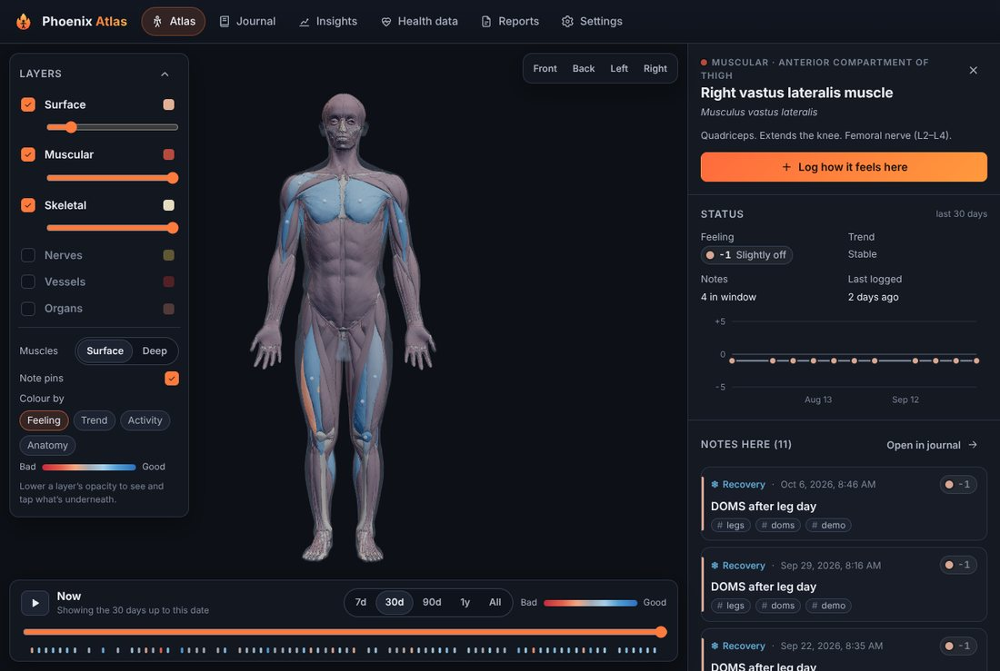
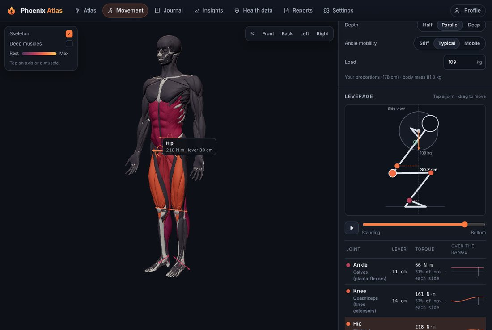
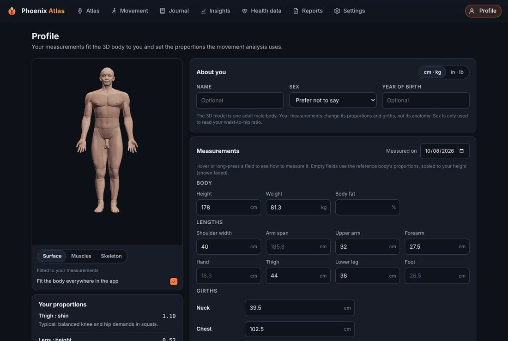
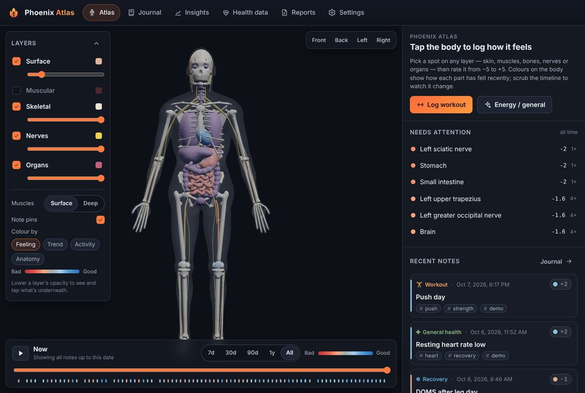
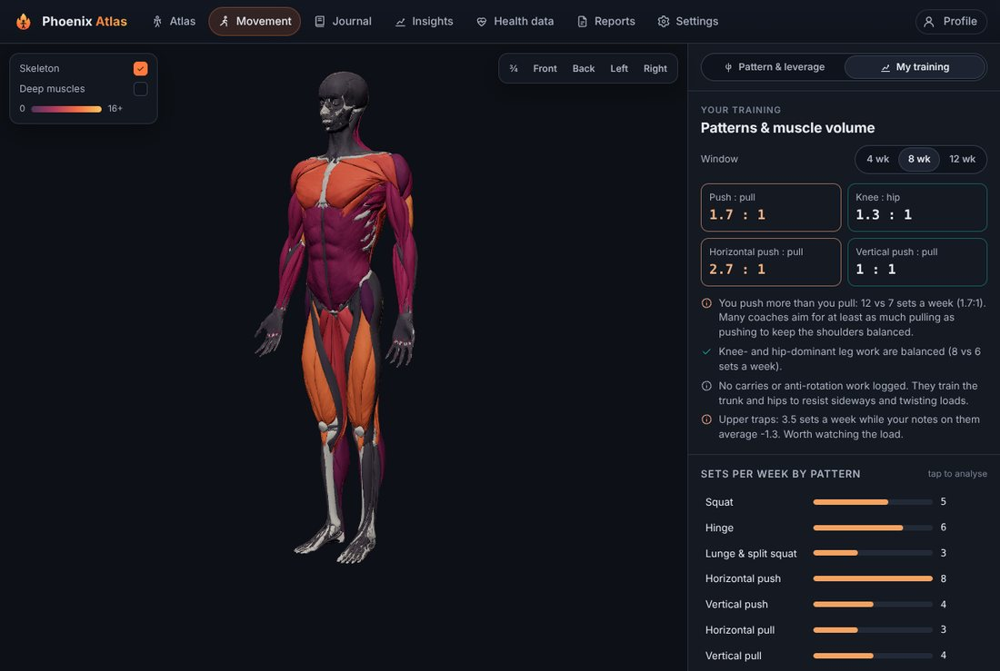
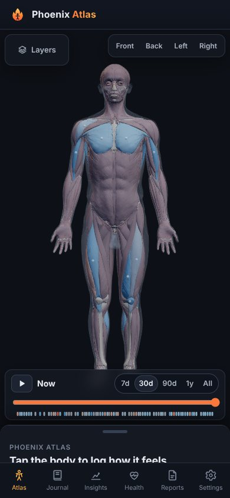
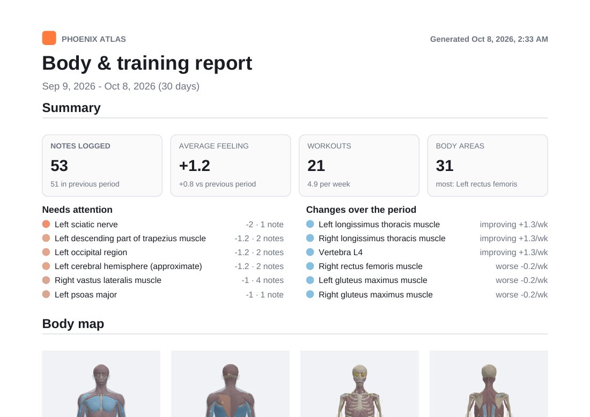
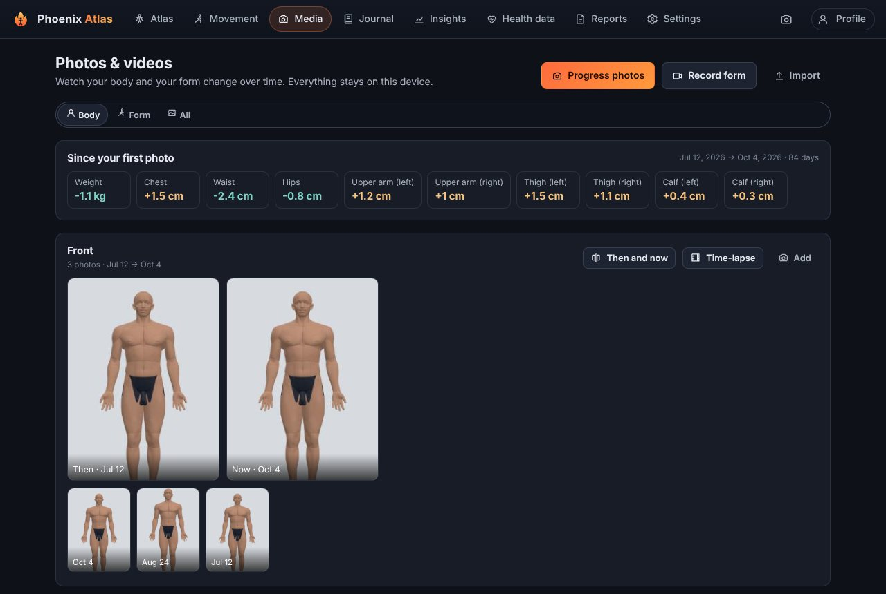
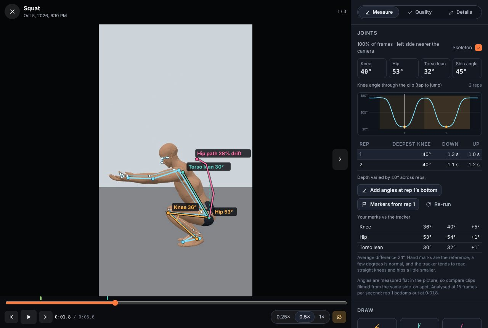
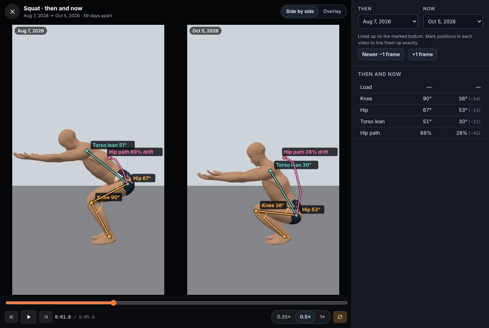

# Phoenix Atlas

A personal body-tracking and analysis app. Tap anywhere on an anatomically
detailed 3D human body (skin regions, muscles, bones, nerves, vessels or organs)
to write a dated note about how it feels, and watch the body change colour as you track workouts, symptoms,
movement, energy and general health over time. Analyse how movement patterns load your muscles and joints,
fit the body to your own measurements, take progress photos and form videos to watch your body and technique
change, import your Google health data and export PDF reports to share with your coach.



| Movement & leverage | Profile & body fitting | Layers (skeleton, nerves, vessels, organs) |
| --- | --- | --- |
|  |  |  |

| Your training balance | Phone | Coach report (PDF) |
| --- | --- | --- |
|  |  |  |

| Progress photos | Form check: joint tracking and angles | Then and now |
| --- | --- | --- |
|  |  |  |

The demo photos are renders of the 3D body fitted to the demo measurements, and the demo clips are the 3D body posed by the squat model and filmed side-on.

## Features

**3D atlas**
- An anatomical model of **2,705 named structures** built from [Z-Anatomy](https://github.com/Z-Anatomy/Models-of-human-anatomy), whose models are based on BodyParts3D (segmented from real scan data). It has six layers:
  - **Surface**: 250 skin regions (anterior region of thigh, popliteal fossa, lumbar region…).
  - **Muscular**: 497 muscles, muscle heads and key fasciae, split into superficial and deep sets.
  - **Skeletal**: every bone, plus ligaments, cartilages, intervertebral discs and menisci.
  - **Nerves**: brain, spinal cord, cranial nerves, plexuses and peripheral nerves down to the digital branches.
  - **Vessels**: 659 arteries and veins.
  - **Organs**: heart chambers and valves, lungs by lobe, digestive and urinary organs, glands and lymph nodes.
- Every structure shows its English and Latin (Terminologia Anatomica) name. Commonly logged muscles also show what they do and which nerve supplies them.
- Search understands everyday words, so "hamstring", "IT band" or "achilles" find the right structures.
- Turn layers on and off and set each layer's opacity. Layers load on demand, and each draws in a single call, so the full model runs on a phone. A layer below 35% opacity becomes a "ghost": you can still see it, but taps go through to whatever is underneath.
- Switch muscles to **Deep** to peel away the superficial muscles and reach the ones underneath (psoas, rotator cuff, erector spinae…).
- Tap a structure to see its status, its feeling chart over time and its notes, then log a new note pinned to the exact spot you tapped.
- **Colour coding** by:
  - **Feeling**: an average of your notes in the time window, with recent notes counting more. Red means worse and blue means better.
  - **Trend**: improving or getting worse.
  - **Activity**: how much you've logged for each part.
  - **Anatomy**: natural anatomical colours.
- **Time scrubber**: drag through your history or press play to watch how your body changed. You can set the window to 7 days, 30 days, 90 days, 1 year or all time.

**Movement analysis**
- Ten fundamental **movement patterns**: squat, hinge, lunge and split squat, horizontal and vertical push, horizontal and vertical pull, loaded carry, rotation and anti-rotation, and running gait. Each has variations (high-bar, low-bar and front squat; deadlift and RDL; bench press and push-up…) and options that change its leverage (depth, ankle mobility, grip width, elbow angle, torso angle).
- **Tagged muscle groups.** 27 functional groups (quads, hamstrings, lats, rotator cuff…) are mapped onto the atlas's individual muscles. Each pattern tags the groups it uses as prime movers, synergists or stabilisers.
- **Colour-coded activation.** The 3D muscles light up by estimated effort as you scrub through the movement (or press play).
- **Interactive leverage.** A diagram poses a stick figure from your own proportions and draws, for every joint, its moment arm: the distance from the joint to the line of the load. You see the torque each joint needs (N·m), as a share of a typical maximum, and how it changes over the range. Drag across the diagram to move through the lift.
- **Joint axes on the body.** Each joint's axis of rotation is drawn on the 3D body, coloured by how hard it works. Tap an axis to see its lever and torque.
- **My training.** Every logged exercise is matched to its pattern. You get weekly sets per pattern and per muscle group (a prime mover counts a full set, a synergist half), push : pull and knee : hip balance, and how each group has felt in your notes, all coloured on the body.
- The atlas links in too: tap a muscle to see its group and the patterns that train it.

**Profile and measurements**
- Record height, weight, body fat, segment lengths (upper arm, forearm, thigh, lower leg, foot, shoulder width, arm span) and girths (neck, chest, waist, hips, and left and right arm, forearm, thigh and calf), each with how to measure it.
- **Fit the 3D body to you.** Height scales the whole body, lengths move the joints, and girths scale the soft tissue around each segment. A live preview shows the result, and you can apply it everywhere in the app. Note pins stay on the same anatomical spot when the body changes.
- Measurements are dated, so you can chart them over time. Weight also goes into your health data.
- A proportions card explains what your measurements mean: thigh-to-shin ratio and squat mechanics, arm span, BMI, waist-to-height and waist-to-hip ratios, and left/right differences.

**Photos and videos**
- **Progress photos.** Take a front, side and back photo in one go. A self-timer with beeps (3, 5 or 10 s) lets you stand back from the phone, guide lines keep your head and feet in the same place, and a **ghost** of your last photo of the pose shows faintly over the camera so you can line up exactly.
- **Form videos.** Record a set (up to two minutes) tagged with its movement pattern, variation, load and reps, or import clips from your library. Photo and video dates are read from the files.
- **Watch your form.** Play clips at ¼ or ½ speed, step frame by frame and loop. Draw on any frame:
  - **Angle**: three taps, for a joint angle such as knee or hip.
  - **Lean**: two taps, for how far a body part leans from vertical (torso, shin).
  - **Path**: one tap per frame, for the bar path and how far it drifts sideways.
  Name measurements the same way each time ("Knee", "Torso lean") and they are charted across clips, so you can see your depth or bar path change over weeks.
- **Leverage synced to your video.** Mark the start and end-range positions (standing and the bottom of a squat), and the movement model's leverage diagram follows the clip as it plays, with the torque at each joint. Drag the diagram to scrub the video.
- **Then and now.** Compare two photos side by side, as a wipe or laid over each other. Drag and zoom one photo to line it up, and the alignment is saved for next time. Two videos play in step, lined up on the position you marked, with their measurements side by side. Body comparisons also show how your measurements changed between the two dates.
- **Time-lapse.** Play every photo of a pose in order, with the date and your weight, and save it as a video to share.
- Photos and videos show up where they belong: the latest set in your Profile, your clips under each movement pattern, and attachments on notes (a photo of a bruise or swelling, a clip from a workout).
- Coach reports can include then-and-now photos and form-check stills with their measurements. This section is off by default, and you can keep any photo or video out of reports.
- Photos are re-encoded when saved, which strips location data. A privacy blur hides body photos in lists until you tap them.

**Computer vision and datasets**
- **Automatic joint tracking.** An on-device pose model (MediaPipe Pose Landmarker, run in the browser; nothing is uploaded) finds 33 body landmarks in every frame. The viewer draws the skeleton over the video, shows your knee, hip, torso and shin angles as it plays, charts the main joint angle through the clip, and finds each rep with its depth and tempo (seconds down and up).
- **One tap to measurements.** Turn the tracker's result into start and bottom markers (so the leverage model follows your video) or into Knee, Hip and Torso lean measurements that chart over time. It also compares itself with the angles you drew by hand.
- **Capture-quality checks.** Each photo and video is checked for resolution, frame rate, framing, body size, camera angle, steadiness, joint confidence, lighting and sharpness, with why each matters and what to change next time.
- **Test the tracker.** The 3D body is posed by the squat model, filmed side-on and tracked; because its true joint angles are known, you see the tracker's error and bias.
- **Build a public dataset.** The Dataset tab walks you through a shot list, checks every file, and exports a ZIP with the media, metadata, pose and measurement annotations, rep timings, quality checks, a dataset card, a datasheet and a license. Faces can be pixelated, dates coarsened, and location metadata is removed from every file (on import as well).
- **Your video archive.** The [archive tool](tools/archive/README.md) runs on a laptop or home server over years of footage, Google Takeout zips included. It finds the clips with you training, tracks the joints with the same model, and makes small copies. In **Media → Archive** you bring its packs in. Each clip comes with a suggested movement (from how the joints move, checked against your training log), a quick screen confirms them in bulk, and the Form tab charts tracked depth and tempo over the years.
- **[The dataset guide](docs/dataset/README.md)** teaches how the computer vision works, how to set up and film, what to capture, how to check and annotate it, how accurate the tracker is, and how to publish.

**Notes**
- Each note is dated (and editable) and has a type (workout, symptom, movement, energy, general health, recovery), a feeling from −5 to +5, sensations (pain, tight, numb, pumped, strong…), an optional 0–10 intensity, one or more body locations, free text, tags, workout details (exercises, sets, reps, load, RPE) and custom measurements.
- **Tags link notes together.** Tap a tag to see every note with it. The Insights page draws a network of which tags appear together.
- **Explicit links and follow-ups.** "Add follow-up" starts a new note with the same locations and tags and links it back to the original. Each thread shows a progress chart, so you can see an issue improve over weeks.
- You can mark a note private to leave it out of coach reports.

**Insights**
- Average feeling compared with the previous period.
- The areas that are improving and the areas that are getting worse.
- A daily feeling chart with a 7-day average.
- A table of every body area with its average, latest value and trend.
- Workouts per week and your most common sensations.
- **How your health data relates to how you feel**: the correlation between sleep, steps, resting HR, HRV and your feeling on the same day and the next day.

**Health data**
- **Live sync from the Google Health API (v4).** This is Google's replacement for the Google Fit and Fitbit Web APIs, which are shutting down in 2026. It syncs steps, distance, calories, heart rate, resting HR, HRV, active minutes, weight, sleep and workouts.
- **File upload**, which needs no setup:
  - Google Takeout `.zip` from **Fit** or **Fitbit**. Big zips are streamed, and only the health files are read.
  - **Health Connect** export `.zip` from Android, read with SQLite in the browser.
  - Any **CSV** with a date column.

**Reports for your coach**
- Choose the period, sections, note types and tags, and write a message to your coach.
- Export a real **PDF** containing:
  - a summary and highlights
  - front and back body maps coloured by feeling (plus deep-layer maps when relevant)
  - a feeling chart
  - an areas table
  - a health data summary
  - a training log
  - your movement balance and muscle-group volume
  - progress photos and form checks, if you turn them on
  - your notes
- **Share** the PDF directly from your phone, or export a **CSV** of your notes, or copy a short **text summary** to paste into a message.

**Working with your coach** (Coach page, linked from Reports and Settings)
- **Pair once by QR code.** Your coach scans it with their phone's camera; both screens show the same check code. The pairing secret stays on the two phones and isn't in backups.
- **Encrypted share files.** Choose a period and what to include: form clips with their joint tracking, progress photos, notes and workouts, measurements, plus a message. The file is encrypted on your phone (AES-256-GCM, a fresh key per file, every chunk checked), so it can go by email, Drive or any messaging app. Only your coach's phone can open it.
- **Your coach's side.** Your clips, by movement with their tracked depth, plus your notes and latest measurements. These are kept apart from the coach's own media and removed if they remove you.
- **Feedback.** Your coach comments on clips and draws angles, then sends an encrypted feedback file back. The comments and drawings appear on your clips, with a feedback inbox.
- No accounts or servers. Private items are never shared, and archive clips' file names stay on your phone.

**Private by design**
- Everything is stored on your device in IndexedDB, including photos and videos. Nothing is uploaded anywhere.
- Back up to a JSON file, or to a ZIP that also holds every photo and video, and restore either from Settings.
- The app installs on your phone and works offline.

## Getting started

```bash
npm install
npm run dev        # http://localhost:5173
```

The 3D model ships with the repository in `public/atlas/`, so there is nothing to generate. To rebuild it from the source data, see [Anatomy data](#anatomy-data).

To explore with sample data, open **Settings → Load demo data**. It loads three months of notes and health metrics, all tagged `#demo`, and you can remove them in one tap.

To use it on your phone, deploy it (see below), open it in Safari or Chrome, and choose **Add to Home Screen** (iOS) or **Install app** (Android).

## Connecting Google health data

### Option A: live sync with the Google Health API

This is a one-time setup of about 5 minutes. You use your own Google Cloud project, so your data goes straight from Google to your browser.

1. Create a project in the [Google Cloud Console](https://console.cloud.google.com/).
2. In **APIs & Services → Library**, enable the **Google Health API**.
3. In **OAuth consent screen**, choose *External* and keep the app in *Testing*. Add yourself as a test user, then add these scopes:
   - `googlehealth.activity_and_fitness.readonly`
   - `googlehealth.health_metrics_and_measurements.readonly`
   - `googlehealth.sleep.readonly`
4. In **Credentials → Create credentials → OAuth client ID**, choose *Web application*. Add your app's address (for example `https://<you>.github.io`, or `http://localhost:5173` while developing) as an **Authorized JavaScript origin**.
5. In Phoenix Atlas, go to **Health data**, paste the client ID and press **Connect & sync**.

The access token lives only in the browser tab's session storage.

### Option B: upload an export

- **Google Takeout**: go to [takeout.google.com](https://takeout.google.com), deselect everything, select **Fit** and/or **Fitbit**, then export and drop the `.zip` into **Health data → Upload**.
- **Health Connect (Android)**: go to Settings → Health Connect → Backup/Export, export to a file, and drop the `Health Connect.zip`.
- **CSV**: use a file with a `date` column. Steps, sleep, resting HR, weight, HRV and similar columns are recognised automatically. Any other numeric columns are kept as custom metrics.

## Deploying

The build output in `dist/` is a static site that works from any path. Host it anywhere: GitHub Pages, Netlify, Vercel, Cloudflare Pages, or a folder on your own server.

To deploy with GitHub Pages:
1. Go to **Settings → Pages** and set the source to **GitHub Actions**.
2. Go to **Actions → Deploy to GitHub Pages → Run workflow**.

GitHub Pages on a private repository requires a paid GitHub plan.

If you use the Google Health sync, add the deployed origin to your OAuth client.

## Development

```bash
npm test           # unit tests (parsers, analysis, notes, reports, anatomy, body fitting, movement models, media, vision, datasets)
npm run typecheck
npm run build      # type-checks and builds to dist/
```

| Path | What's there |
| --- | --- |
| `src/anatomy/` | The structure catalog (`catalog.json`, generated), reference notes, the layer file format, and the map from the first model's ids. |
| `src/model/` | Loads a layer into one merged geometry, picks structures through a BVH, the shader material that colours and hides structures, and the body fitting (`bodyShape.ts`). |
| `src/movement/` | Muscle groups, the movement pattern library, the biomechanics models, effort estimates and training analysis. |
| `src/profile/` | Profile and measurement storage. |
| `src/media/` | Photo and video storage, the geometry of angle, lean and path measurements, photo and video processing (EXIF and MP4 dates, thumbnails, stills), and the demo media. |
| `src/components/media/` | The camera, the viewer with its measuring tools, joint tracking and quality panels, the comparison and time-lapse screens, and the Dataset tab. |
| `src/vision/` | Pose tracking (MediaPipe runner and job queue), joint angles, rep detection, guessing the movement, quality checks, and the tracker test. |
| `src/dataset/` | Dataset export: ids, metadata, dataset card, datasheet, face pixelation. |
| `src/coach/` | Pairing codes and links, encrypted share and feedback files (WebCrypto), and importing them on the other phone. |
| `src/media/archive.ts` | Reading the archive tool's packs and folders, and bringing clips in with their tracks and suggestions. |
| `tools/archive/` | The archive tool (Python): finds, sorts and tracks videos in folders and Takeout zips, with its own guide and tests. |
| `scripts/vision-assets.mjs` | Copies the pose-tracking WebAssembly runtime into `public/vision/` and downloads the pinned model (checked by SHA-256). Runs before `dev` and `build`. |
| `scripts/build-landmarks.ts` | Measures the reference body (joint centres, segment lengths and girths) into `src/anatomy/landmarks.json`. |
| `scripts/build-atlas.ts` | Builds `public/atlas/*.bin` and `catalog.json` from the anatomical dataset. |
| `src/components/viewer/` | The react-three-fiber body viewer, layer panel, time bar and structure panel. |
| `src/db/` | Dexie (IndexedDB) schema, notes with links and follow-ups, backup/restore (with a small streaming ZIP writer and reader for media), and demo data. |
| `src/analysis/` | Per-structure status, trends, correlations, and the colour mapping. |
| `src/health/` | Google Takeout, Fitbit, Health Connect and CSV parsers, plus the Google Health API client. |
| `src/report/` | Report data, offscreen body snapshots, PDF (jsPDF) and CSV export. |
| `src/pages/` | Atlas, Movement, Media, Journal, Insights, Health data, Reports, Profile and Settings. |

### How the movement analysis works

Each pattern is a quasi-static model: the movement is treated as slow enough that inertia can be ignored. The model poses your segments at a point in the range and keeps you balanced over mid-foot where that applies. It then sums the torque from the load and from each body segment, using the masses and centres of mass in Winter's anthropometric tables. Pressing and pulling use a 3D arm with two links, so grip width and elbow angle matter. Running uses a typical ground reaction force over the stance phase.

Estimated effort is a joint's torque as a share of a typical maximum for a trained adult (for example 3.5 N·m per kg of body mass for the knee extensors). It is scaled by the group's role. These are estimates from the mechanics for learning and planning. They are not measured muscle activity (EMG) and not a clinical assessment.

### How body fitting works

The reference body is described by a simple skeleton, with joint centres measured from the model (for example a sphere fitted to each femoral head). Every vertex follows the up-to-three segments nearest to it. Arms only follow arm segments and legs only follow leg segments, so a hand resting against the thigh doesn't move with the leg. Notes keep their points on the reference body, and the points are mapped onto the fitted body for display.

### How the joint tracking works

`scripts/vision-assets.mjs` puts the MediaPipe runtime and the Pose Landmarker (full) model in `public/vision/` (not committed), so the app serves them itself and caches them for offline use the first time they're needed. A video is analysed by seeking through it at 15 frames per second and running the model on each frame. Angles are computed in pixels from the near-side landmarks; reps are dips of at least 25° in the movement's main joint angle (knee, hip or elbow). The synthetic squat used to test the tracker is the atlas skin posed with linear-blend skinning from the squat model (`src/media/synthetic.ts`), so its true joint positions are known in every frame. The [dataset guide](docs/dataset/README.md) explains the method and its accuracy.

### How the photo and video tools work

Measurements are stored as points in fractions of the frame, and angles are worked out in the frame's real proportions, so they read the same on any screen. Videos record as WebM where the browser supports it and as MP4 on Safari. Files are kept as Blobs in IndexedDB apart from their details, so lists stay fast, and the app asks the browser for persistent storage the first time you save one. A ZIP backup stores media files as they are: writing it only reads each video once (for its checksum), and restoring reads slices of the file, so large videos never have to fit in memory.

Angles drawn on a photo depend on the camera angle: film side on, at hip height, from the same spot each time for numbers you can compare.

### Rendering

Each layer is one merged mesh in which every vertex carries the index of its structure. A small data texture holds a colour and flags for each structure, so the viewer can recolour, highlight or hide any of them without extra draw calls. Taps are ray cast through a bounding volume hierarchy (three-mesh-bvh), and nerves and vessels get a ring of extra rays so a near miss still selects them.

## Anatomy data

The model is adapted from the Svitylo 3D Anatomy Atlas data release 1.1.0, which packages:

- **Z-Anatomy** (CC BY-SA 4.0), based on **BodyParts3D, © The Database Center for Life Science** (CC BY-SA 2.1 JP)
- kidneys from the **Human Reference Atlas** (Browne, Schlehlein; CC BY 4.0)
- the inner ear and ossicles from **OpenEar** (Sieber et al.; CC BY 4.0)

Phoenix Atlas's adapted model (`public/atlas/*.bin` and `src/anatomy/catalog.json`) is shared under **CC BY-SA 4.0**. [`public/atlas/ATTRIBUTION.md`](public/atlas/ATTRIBUTION.md) has the full attribution and the list of changes.

Some limits to know about:

- The source's cerebral cortex isn't openly licensed, so the two cerebral hemispheres are an approximate shape fitted to the skull. They are labelled "approximate" in the app.
- The upstream release hasn't had a formal anatomical review yet.
- The model is one adult male body.

To rebuild the model:

```bash
npm run anatomy:fetch   # downloads the data release from npm into .cache/anatomy (about 70 MB)
npm run model           # checks the checksums, writes public/atlas/*.bin and src/anatomy/catalog.json, then re-measures the landmarks
```

Pose tracking uses **MediaPipe Tasks Vision** and the **Pose Landmarker** model by Google (Apache-2.0), downloaded at build time.

Notes saved with the first, procedural body model are migrated automatically. Their structures are mapped to the closest atlas structure, and their pins are moved onto the new surface.

## Disclaimer

Phoenix Atlas is a personal tracking tool, not a medical device. Its anatomy is detailed and uses real anatomical names, but it is meant for education and tracking. It doesn't diagnose or treat anything. Talk to a qualified professional about symptoms that concern you.
