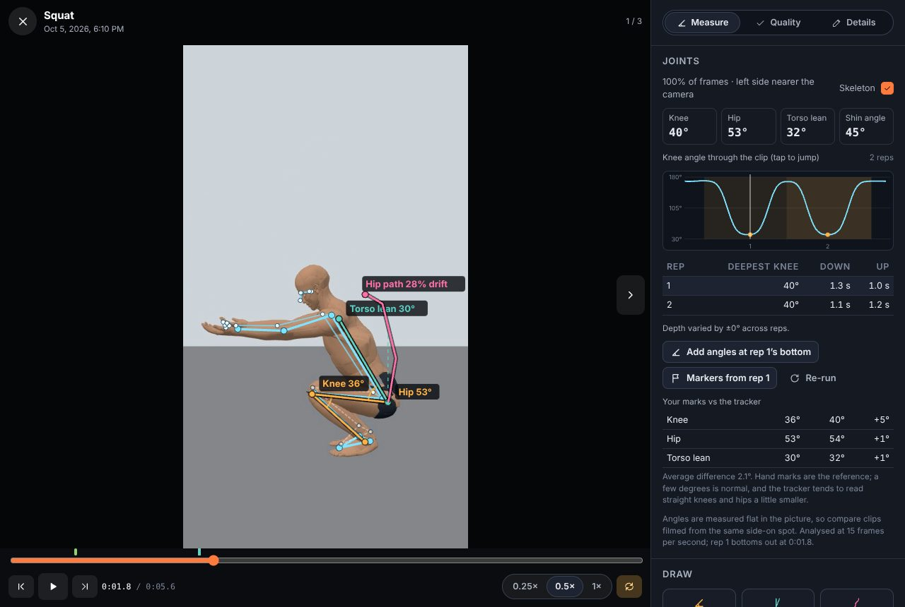
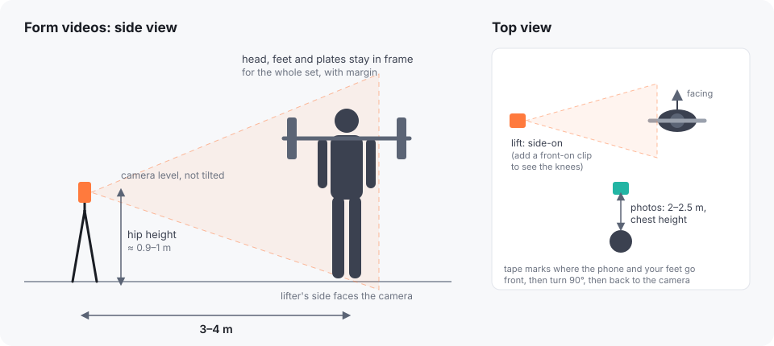
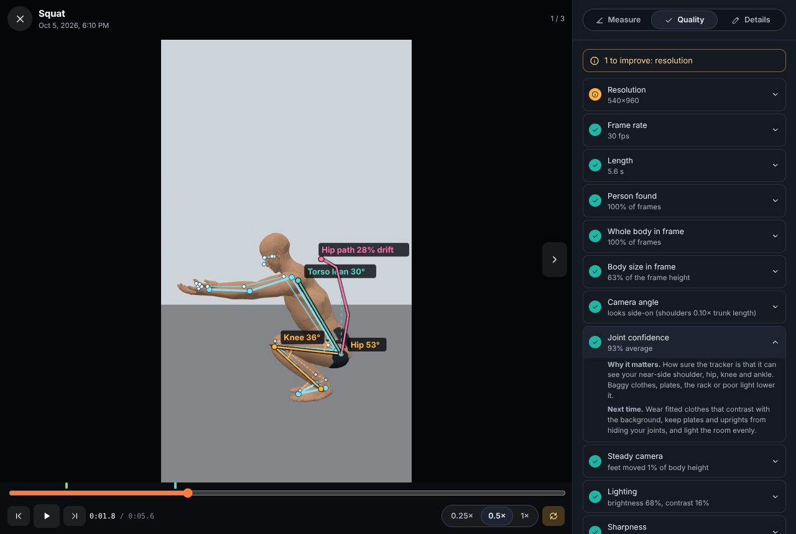
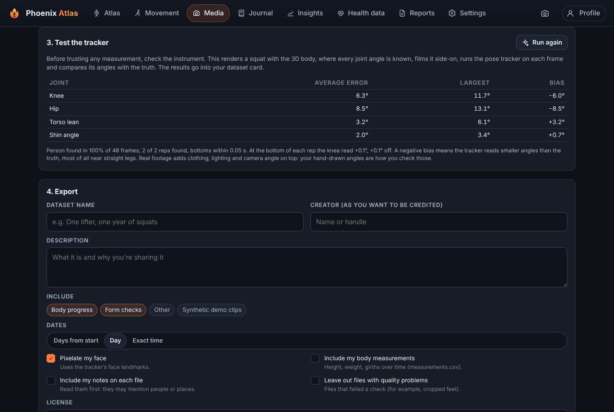
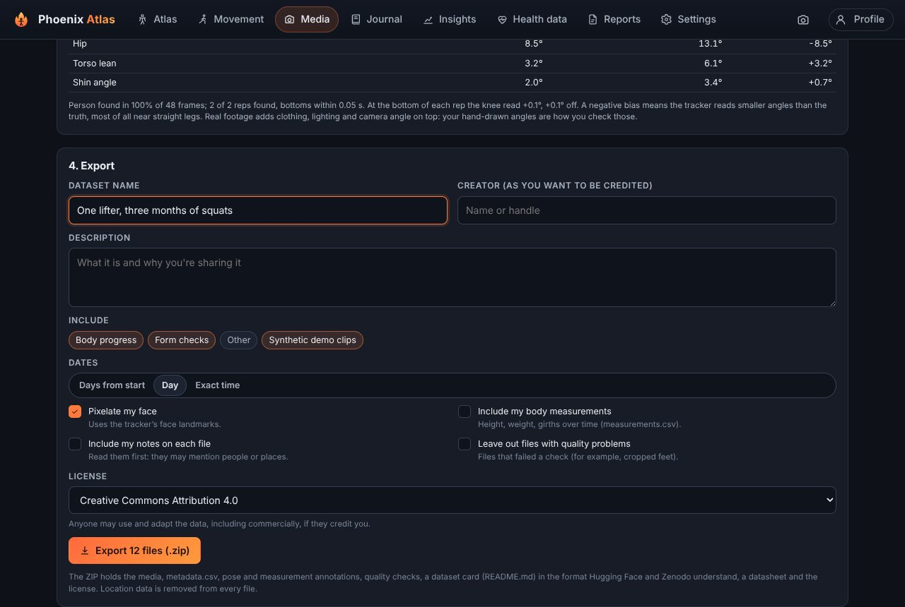

# Building a personal training dataset with computer vision

This guide teaches you how to capture, check, measure and publish photos and videos of your own training, so that you, and anyone you share them with, can analyse how a body and its technique change over time. It explains what the computer vision in Phoenix Atlas does, why it was designed this way, and exactly what to prepare.

You don't need to know any programming to follow it. [Section 12](#12-using-a-dataset) shows how to read a dataset with a few lines of Python.

**Contents**

1. [What you'll make](#1-what-youll-make)
2. [How the computer vision works](#2-how-the-computer-vision-works)
3. [Decide what you're comfortable sharing](#3-decide-what-youre-comfortable-sharing)
4. [Set up your space](#4-set-up-your-space)
5. [The shot list](#5-the-shot-list)
6. [Capture in Phoenix Atlas](#6-capture-in-phoenix-atlas)
7. [Check every file](#7-check-every-file)
8. [Annotate: find joints and draw your own reference angles](#8-annotate)
9. [Test the tracker before you trust it](#9-test-the-tracker-before-you-trust-it)
10. [Export](#10-export)
11. [Publish](#11-publish)
12. [Using a dataset](#12-using-a-dataset)
13. [Why it's designed this way](#13-why-its-designed-this-way)
14. [Checklist](#14-checklist)
15. [Glossary](#15-glossary)

---

## 1. What you'll make

A **dataset** is more than a folder of files. It is the files **plus everything needed to understand and reuse them**:

| Part | What it answers |
| --- | --- |
| The photos and videos | What was seen. |
| Metadata (`metadata.csv`) | What each file is: movement, load, reps, camera angle, date. |
| Annotations | What was measured: joint positions in every frame, angles, reps. |
| Quality checks | How trustworthy each file is for measuring. |
| A validation result | How accurate the measuring tool is. |
| A dataset card and datasheet | Why it exists, how it was made, what it may be used for. |
| A license | What others are allowed to do with it. |

Phoenix Atlas builds all of these for you. Your job is to capture good footage, check it, draw a few reference angles by hand, and decide what to share.

```
capture → check quality → find joints → draw reference angles → test the tracker → export → review → publish
```

## 2. How the computer vision works

### Pose estimation

The app uses **MediaPipe Pose Landmarker** (Google, Apache-2.0), a neural network trained on many thousands of labelled photos of people. Given one image it outputs **33 landmarks**: nose, eyes, ears, mouth, shoulders, elbows, wrists, hands, hips, knees, ankles, heels and toes. Each landmark has:

- **x, y**: where it is in the picture, as fractions of the width and height (0,0 is the top left).
- **visibility**: how confident the model is that the point is visible (0 to 1). Joints hidden behind a plate, the rack or the other leg get low visibility.
- a rough **3D position** in metres around the hips (the model's guess at depth; noisier than x and y).

For a video, the app seeks to 15 frames per second (10 for clips over 45 seconds), runs the model on each frame, and keeps the results as a **pose track**. Everything runs **on your device**: the model file is served by the app itself, and no image is uploaded.



### From landmarks to angles

An angle needs three points: one end, the joint, and the other end. The knee angle is the angle at the knee between the hip and the ankle. The app computes it in **pixels**, not in fractions, because a portrait frame is taller than it is wide, and measuring in fractions would distort every angle.

```
knee angle = angle between (hip − knee) and (ankle − knee)
           = arccos( (u · v) / (|u| |v|) )
```

A **lean** (torso lean, shin angle) uses two points and is measured from vertical.

### Reps, depth and tempo

Each movement has a joint that opens and closes once per rep: the knee for squats and lunges, the hip for hinges, the elbow for presses and pulls. The app smooths that angle over time, then finds each **dip of at least 25°**. The lowest point is the **bottom** (depth). The highest points either side are the **start** and **end**. The time from start to bottom is the **down** phase; from bottom to end is the **up** phase.

### What it can't do

- **It sees in 2D.** An angle in the picture equals the real angle only when the joint moves in a plane facing the camera. Filmed side-on, knee, hip and torso angles are close to true. Filmed at 45°, the same squat gives different numbers. **This is why every guideline below insists on side-on, from the same spot.**
- **It guesses hidden joints.** If a plate hides your hip, the point is an educated guess, and its visibility is low.
- **It was trained on photos, not on your gym.** Baggy clothes, dark rooms, mirrors and other people all make it worse.
- **Its landmarks aren't joint centres.** The model learned where people *click* when labelling a knee, which isn't the exact centre of rotation of the knee. It reads straight legs a few degrees smaller than they are (see [section 9](#9-test-the-tracker-before-you-trust-it)).

## 3. Decide what you're comfortable sharing

Do this **before** you film, because it changes what you film.

- **Publishing is permanent.** Once others have downloaded a dataset you can't take it back. Start with a small version.
- **Your face identifies you.** The export can pixelate it using the face landmarks. Tattoos, a distinctive gym or a window view can identify you too: film against a plain background.
- **Other people** in the frame must agree to be in a public dataset. It's simpler to film alone.
- **Location.** Phones store GPS coordinates inside photos and videos. Phoenix Atlas removes them: photos are re-encoded when saved, and video metadata boxes are cleared on import and again on export.
- **Dates.** Choose whether to share exact times, calendar days, or only "day 0, day 14…" from the start.
- **Body measurements and notes** are left out unless you tick them.
- **Mark any file Private** (in its details) to keep it out of every export and report.

## 4. Set up your space



**Equipment**

- Any recent phone. Set the camera to **1080p at 60 fps** (or at least 30 fps).
- A **tripod** or something solid to prop the phone on. A handheld camera moves, and the moving camera shifts every angle.
- Optional: floor tape to mark where the phone and your feet go, so every session is filmed from the same spot.

**For lifts**

- Phone at **hip height** (about 0.9–1 m), **level** (not tilted up or down), **3–4 m away**.
- **Side-on**: your side faces the camera. The bar's end points at the lens.
- **Head, feet and plates stay in frame** for the whole set, with a little margin (more if you press overhead).
- Note which side faces the camera, and keep it the same each time.

**For progress photos**

- Phone at **chest height**, **2–2.5 m** away, upright.
- Same place, same light, same time of day (mornings before eating are most consistent), same clothes.
- Front, then turn 90° to your right (your left side to the camera), then back to the camera.

**Light, background and clothes**

- Face the light or have it to the side. A bright window behind you turns you into a silhouette.
- A plain wall works best. Avoid mirrors behind you; the model can find your reflection.
- **Fitted clothes that contrast with the background.** The model needs to see where your hips and knees are.

## 5. The shot list

The **Dataset** tab (Media → Dataset) tracks this list for you.

| Shot | Why | How often |
| --- | --- | --- |
| Progress photos: front, side, back | Shape change over time; the core of a body-progress dataset. | Every 2–4 weeks, on measuring days if you can. |
| A **side-on** clip of each movement you train | The angles that matter (knee, hip, torso) are true side-on. | Every few weeks, or when you change something. |
| A **front-on** squat or lunge | Shows whether the knees cave in, which side-on can't. | Occasionally. |
| A clip with a **deliberately imperfect rep** (tag it `flawed`) | Tests whether the analysis notices: a shallow rep, a forward lean. | Once per movement. |
| **3+ clips with angles you drew by hand** | Your reference for checking the tracker on your own footage. | Once, then now and then. |
| A **known size** in frame (a 45 cm plate; tag it `scale`) | Lets distances and bar speed be measured later. | Some clips. |

**One set per clip.** Start recording a second before the first rep and stop a second after the last. Log the movement, variation, load and reps when you save.

## 6. Capture in Phoenix Atlas

1. Tap the **camera** button at the top of any page → **Form video** (or **Progress photos** for front, side and back in one go).
2. Choose the movement at the bottom of the camera. For photos, the **ghost** shows your last photo of the pose faintly over the camera: line up with it.
3. Set the **self-timer** (3, 5 or 10 s) so you can get into position.
4. Record. When you save, check the movement, variation, load, reps and **Filmed from** (side on, front, behind, 45°).
5. Already have footage? **Import** it: dates are read from the files, and location data is removed.

## 7. Check every file

Open a file and choose **Quality**, or see every file at once in **Media → Dataset**. Each check says what it measured, why it matters, and what to do next time.



| Check | Measured | Good | Why it matters |
| --- | --- | --- | --- |
| Resolution | Shorter side, pixels | ≥ 720 (video), ≥ 1080 (photo) | More pixels on the body, more precise joints. |
| Frame rate | Real frames per second | ≥ 30, ideally 60 | Timing of the bottom and of tempo; bar speed later. |
| Length | Seconds | 3–90 s | One set per clip. |
| Person found | Share of frames with a person | ≥ 90% | Whole reps need every frame. |
| One person | Frames with two or more people | < 10% | The tracker can switch person, and others need consent. |
| Whole body in frame | Share of frames with head, near-side shoulder, hip, knee, ankle, heel and toe inside the frame | ≥ 90% | Cropped feet mean no ankle or knee angle. |
| Body size | Head-to-feet height as a share of the frame | 45–95% | Too small: few pixels per joint. Too big: you leave the frame. |
| Camera angle | Shoulder width ÷ trunk length (side-on < 0.35, front-on > 0.65) | Matches the tag | Side-on angles are true; front-on shows knee tracking. |
| Joint confidence | Average visibility of the near-side joints | ≥ 0.8 | Low when clothing, plates or light hide joints. |
| Steady camera | How much the planted heel moves in the picture | < 2% of body height | Feet don't move in a squat; if they move in the picture, the camera did. |
| Lighting | Mean brightness, contrast, and whether you're darker than the background | Brightness 20–85%, contrast ≥ 10% | Dark, flat or backlit images hide edges. |
| Sharpness | Variance of the Laplacian (edge strength) on a 256-pixel copy | ≥ 60 | Motion blur smears joints at the fastest part of a rep. |
| Same setup as last time (photos) | Body size and position vs the last photo of the pose | Within 6% and 5% | Otherwise you see the camera move, not your body. |

The **Laplacian** is an image filter that responds to edges. Its variance is a classic, simple blur detector: a blurry image has weak edges and a low variance.

## 8. Annotate

### Find joints automatically

Open a clip → **Measure** → **Find joints automatically** (or **Find joints in N files** in the Dataset tab). You get the skeleton over the video, the angles right now, the main joint angle through the clip with each rep shaded, and a table of depth and tempo per rep. Two buttons turn the tracker's results into data you can keep:

- **Markers from rep 1** sets the start and bottom markers, so the leverage model follows your video.
- **Add angles at rep 1's bottom** creates Knee, Hip, Torso lean (and Shin angle) measurements, named so they chart over time with your other clips.

### Draw your own reference angles

Automatic measurements need a reference. On 3 or more clips, pause at the bottom of a rep and draw the angles **by hand** with the Angle and Lean tools, putting each point on the centre of the joint. Name them exactly **Knee**, **Hip**, **Torso lean**, **Shin angle**. The Measure panel then shows **Your marks vs the tracker**: the difference for each angle and the average (the **mean absolute error**, MAE).

A few degrees of difference is normal. If yours are much larger, look at the quality checks for that clip: usually it's the camera angle, clothing or a hidden joint.

> **Tip:** have a friend mark the same frames without seeing your marks. The difference between the two of you tells you how precise hand marking itself is. Tracker errors smaller than that difference are as good as a person.

## 9. Test the tracker before you trust it

Every measuring instrument has an error. To measure the tracker's, the app uses a **synthetic squat**: the anatomical 3D body is posed by the squat model with linear-blend skinning (each vertex follows the bones near it), lit, and filmed side-on. Because the pose is generated, the true joint positions in every frame are known exactly. The tracker runs on each frame, and its angles are compared with the truth.

Run it from **Media → Dataset → Test the tracker**. The result goes into your dataset card. Here is a run (side-on parallel squat, 60 frames):

| Joint | Mean error | Largest | Bias |
| --- | --- | --- | --- |
| Knee | 6.3° | 11.7° | −6.0° |
| Hip | 8.5° | 12.6° | −8.5° |
| Torso lean | 3.2° | 6.1° | +3.2° |
| Shin angle | 2.0° | 3.7° | +0.7° |

The person was found in every frame, both reps were found, and the bottoms were found at the right time. **At the bottom of each rep the knee was within 1°** of the truth on parallel and deeper squats, and about 9° off on a half squat. Most of the average error comes from the standing part, where the tracker reads straight knees and hips 6–10° smaller than they are. This is the **bias**: a consistent offset, not random noise.

What this means for you:

- **Depth at the bottom is reliable** to a few degrees side-on; comparing your depth week to week is sound.
- **Straight-leg angles read low.** Don't conclude you're not locking out because the tracker says 170°.
- **Torso lean and shin angle are the most accurate** measurements.
- **Real footage adds error**: clothing, lighting, camera angle. Your hand-drawn reference angles measure that part.

The synthetic clips in the demo data are tagged `synthetic`, and their "hand" angles are drawn exactly on the true joints, so their agreement table shows the tracker's error directly.



## 10. Export

**Media → Dataset → Export** builds a ZIP. The options:

| Option | Default | What it does |
| --- | --- | --- |
| Include | Body progress, Form checks | Which kinds of file. Private files are never included. |
| Dates | Day | Exact time, calendar day, or days from the first file. With anything but exact, video creation dates are cleared too. |
| Pixelate my face | On | Covers the head with coarse blocks using the face landmarks. Videos are re-recorded to do it (in real time, without sound). Files where no person was found are left out, to be safe. |
| Body measurements | Off | Adds `measurements.csv`. |
| Notes | Off | Adds your notes to the metadata. Read them first. |
| Leave out files with quality problems | Off | Drops files that failed a check. |
| License | CC BY 4.0 | See [section 11](#11-publish). |



### What's in the ZIP

```
your-dataset/
  README.md              dataset card (Hugging Face / Zenodo compatible front matter)
  DATASHEET.md           Datasheets for Datasets answers; fill in the marked parts
  LICENSE.txt
  metadata.csv           one row per file (also metadata.jsonl)
  schema.json            what every field means
  validation.json        tracker test results (if you ran it)
  measurements.csv       only if you chose to include it
  media/photos/          progress-front-001.jpg …
  media/videos/          form-squat-001.webm …
  annotations/marks/     your measurements, with values
  annotations/pose/      33 landmarks per analysed frame
  annotations/reps/      start, bottom, end, depth and tempo per rep
  annotations/quality/   every check, with its explanation
```

Files are named by **what they are** (`form-squat-003`), never by date or anything personal.

**metadata.csv** (excerpt of the columns):

| Column | Example | Meaning |
| --- | --- | --- |
| `id` | form-squat-003 | Dataset id. |
| `purpose` | form | progress, form or other. |
| `pattern`, `variant` | squat, highbar | Movement and variation. |
| `load_kg`, `reps_logged` | 100, 5 | As logged. |
| `camera_angle` | side | As tagged. |
| `date` | 2026-10-05 or 43 | At the precision you chose. |
| `source_fps` | 30 | Measured frame rate. |
| `pose_tracked`, `person_found` | true, 0.98 | Tracking coverage. |
| `reps_detected`, `deepest_angle_mean` | 5, 64.2 | From the joint angles. |
| `hand_marks` | 3 | Reference angles you drew. |
| `quality`, `quality_notes` | improvable, Lighting | Summary of the checks. |
| `synthetic`, `faces_pixelated` | false, true | Provenance and privacy. |

**annotations/pose/form-squat-003.json** (shortened):

```json
{
  "model": "mediapipe-pose-landmarker-full/float16/1",
  "width": 1080, "height": 1920, "analysed_fps": 15, "source_fps": 60,
  "landmark_names": ["nose", "left_eye_inner", "…", "right_foot_index"],
  "frames": [
    { "t": 0.0, "people": 1, "landmarks": [[0.512, 0.181, 0.998], "… 33 points"], "world": [[0.01, -0.62, -0.25], "…"] }
  ]
}
```

**annotations/marks/form-squat-003.json** (shortened):

```json
{
  "phase_start_s": 0.6, "phase_end_s": 1.7,
  "marks": [
    { "type": "angle", "label": "Knee", "source": "hand", "points": [[0.71, 0.70], [0.45, 0.68], [0.63, 0.78]],
      "time_s": 1.7, "value": 35.9, "unit": "degrees" }
  ]
}
```

## 11. Publish

**Review first.** Unzip the export and look at every file. Read `README.md` and `DATASHEET.md` and fill in the parts marked *to be completed by the creator* (contact, where it's published, funding, others in frame).

**Choose a license**

- **CC BY 4.0**: anyone may use it, including commercially, if they credit you. The usual choice for open data.
- **CC BY-NC 4.0**: non-commercial use only.
- **CC0**: no conditions at all.

**Choose where**

- **Hugging Face Datasets**: upload the folder as a dataset repository; the README's front matter becomes the dataset card. Good for machine-learning users.
- **Zenodo**: gives the dataset a permanent DOI so it can be cited, and keeps every version.
- **GitHub**: fine for the documents and small samples; large videos need Git LFS. Don't put personal media in the app's source repository.

**Version it.** Publish a new version (v1, v2…) as you add footage, and say in the README what changed. Ids are numbered in date order within each kind of file, so adding newer files keeps the existing ids; importing older files or leaving files out renumbers them, so mention it when that happens.

## 12. Using a dataset

[`examples/knee_angles.py`](examples/knee_angles.py) reads an exported dataset with only the Python standard library. For each squat or lunge video it computes the knee angle from the landmarks, finds the reps, and compares the tracker with your hand-drawn angles:

```
$ python knee_angles.py my-dataset

form-squat-003  (2026-10-05, left side to camera, 2 reps)
  rep 1: knee  40.4 deg at 1.80 s, 1.27 s down, 1.00 s up
  rep 2: knee  40.2 deg at 3.93 s, 1.13 s down, 1.20 s up
  hand-drawn knee 35.9 deg at 1.70 s; tracker 40.5 deg (+4.6)
```

The essential lines, to adapt for any joint:

```python
import json, math
track = json.load(open("annotations/pose/form-squat-003.json"))
names, w, h = track["landmark_names"], track["width"], track["height"]
hip, knee, ankle = (names.index(n) for n in ("left_hip", "left_knee", "left_ankle"))

def angle(a, b, c):
    u, v = (a[0] - b[0], a[1] - b[1]), (c[0] - b[0], c[1] - b[1])
    return math.degrees(math.acos((u[0]*v[0] + u[1]*v[1]) / (math.hypot(*u) * math.hypot(*v))))

for f in track["frames"]:
    lm = f["landmarks"]
    if lm and min(lm[i][2] for i in (hip, knee, ankle)) > 0.5:   # all three visible
        px = lambda i: (lm[i][0] * w, lm[i][1] * h)                # fractions → pixels
        print(f["t"], round(angle(px(hip), px(knee), px(ankle)), 1))
```

## 13. Why it's designed this way

| Decision | Why |
| --- | --- |
| **On-device tracking** (MediaPipe in WebAssembly, model served by the app) | Your body photos never leave your phone to be analysed. It also works offline. |
| **MediaPipe Pose (full model)** | Open license, runs in any modern browser, 33 landmarks including heels and toes (needed for ankle angles), and a confidence per landmark. The full model is more precise than the lite one; since clips are analysed after recording, not live, its extra cost doesn't matter. |
| **2D angles in pixels** | They match what you draw by hand, so the two can be compared directly. 3D estimates from one camera are much noisier. |
| **Side-on as the standard** | The angles of the squat, hinge and lunge happen in the plane a side-on camera sees. |
| **15 frames per second for analysis** | Enough to find the bottom of a rep (one frame is 67 ms) while keeping analysis time reasonable on a phone. |
| **Hand-drawn reference angles** | A tracker's error depends on the footage. Drawing a few angles yourself is the only way to know the error on yours. |
| **A synthetic known-answer test** | Real footage never comes with true joint angles. A posed 3D body does, so the tracker's own error can be separated from the footage's. |
| **Quality checks with reasons** | They teach what makes footage measurable, and record in the dataset how each file measured up. |
| **Privacy on by default** | Faces pixelated, dates at day precision, measurements and notes off, location removed from every file. Sharing more is a deliberate choice. |
| **Plain formats** (CSV, JSON, JPEG, WebM/MP4, Markdown) | Readable without special tools, for decades. |
| **Datasheet and dataset card** | The standard questions (Gebru et al., *Datasheets for Datasets*) make sure others know how and why the data was collected, and what not to use it for. |

## 14. Checklist

**Before filming**
- [ ] Decided what you're comfortable sharing (face, dates, measurements, location of filming).
- [ ] Tripod, plain background, light in front or to the side, fitted contrasting clothes.
- [ ] Camera at 1080p, 60 fps; tape marks for the phone and your feet.

**Each session**
- [ ] Phone level at hip height, 3–4 m away, side-on; head, feet and plates in frame.
- [ ] One set per clip; movement, load, reps and camera angle saved with it.
- [ ] Progress photos from the same spot, using the ghost.

**Before exporting**
- [ ] Joints found in every file; quality problems fixed or files left out.
- [ ] 3+ clips with hand-drawn Knee / Hip / Torso lean angles.
- [ ] Tracker test run.
- [ ] Private files marked Private.

**Before publishing**
- [ ] Looked through every exported file.
- [ ] Filled in the open parts of DATASHEET.md and README.md.
- [ ] Chosen a license and a place; noted the version.

## 15. Glossary

- **Landmark / keypoint**: a body point the pose model locates (e.g. left knee).
- **Visibility**: the model's confidence (0–1) that a landmark is visible.
- **Pose track**: the landmarks for every analysed frame of a video.
- **Near side**: the side of the body facing the camera; its landmarks are the reliable ones side-on.
- **Bias**: the average signed error; a consistent offset.
- **Mean absolute error (MAE)**: the average size of the errors, ignoring sign.
- **Ground truth / reference**: the measurement you compare against (hand-drawn angles, or the known angles of a synthetic clip).
- **Synthetic data**: generated rather than recorded; here, renders of a posed 3D body with known angles.
- **Linear-blend skinning**: posing a 3D mesh by letting each vertex follow a weighted mix of nearby bones.
- **Laplacian variance**: a simple sharpness measure; low values mean blur.
- **Dataset card**: the README that describes a dataset, its contents and its intended uses.
- **Datasheet**: answers to standard questions about a dataset's motivation, composition, collection and use.
